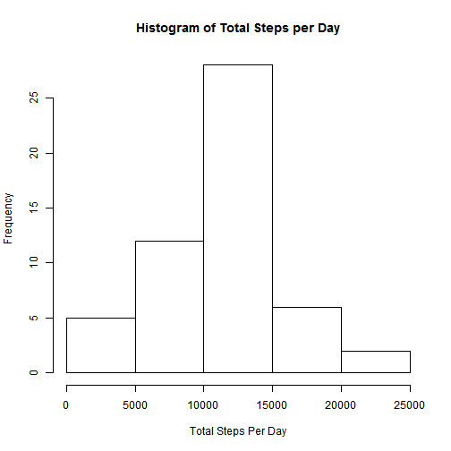
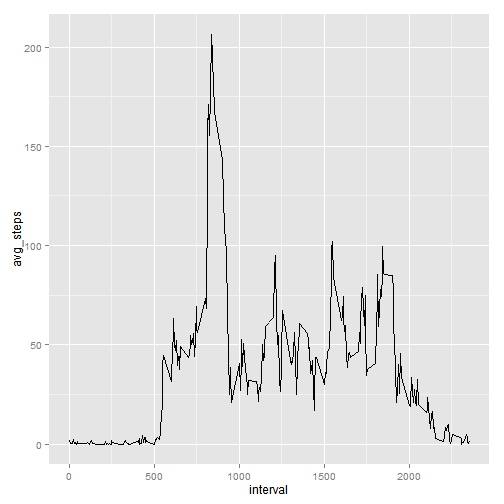
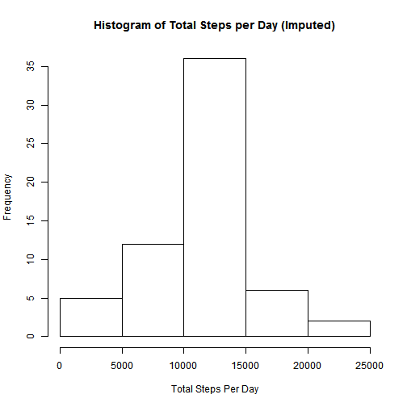
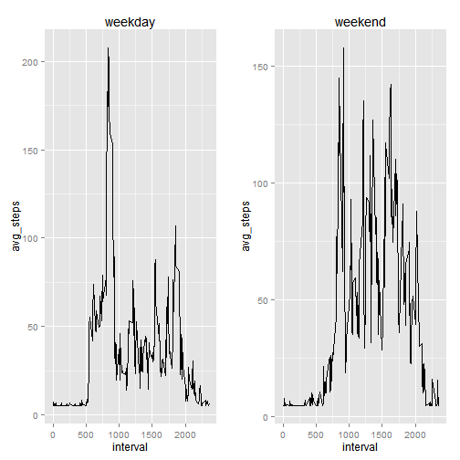

# Reproducible Research: Peer Assessment 1

## Loading and preprocessing the data

```r
adf <- read.csv("~/RR/P2P1/RepData_PeerAssessment1/activity.csv", header=TRUE)
adf$date <- as.Date(adf$date, "%Y-%m-%d")
library("ggplot2", lib.loc="~/R/win-library/3.1")
```

## What is mean total number of steps taken per day?

```r
countSteps <- function(adf) {
  # find all the dates in the dataset
   Dates <- as.Date(strftime(adf$date, "%Y-%m-%d"))
   # build a temporary series of all the possible days in the set
   allDates <- seq(from = min(Dates), to = max(Dates), by = "day")
   # take the average of all the steps in each day, for each day
   steps <- sapply(allDates, FUN = function(X) sum(adf$steps[adf$date == X]))
   # assign the result to a data frame
   data.frame(day = allDates, steps = steps)
}

sc <- countSteps(adf)
hist(sc$steps, main='Histogram of Total Steps per Day', xlab='Total Steps Per Day')
```

 

mean steps per day is:


```r
mean(sc$steps, na.rm=TRUE)
```

```
## [1] 10766
```

median steps per day is:


```r
median(sc$steps, na.rm=TRUE)
```

```
## [1] 10765
```

## What is the average daily activity pattern?

```r
avgSteps <- function(adf) {
   # get all the valid interval values
   allIntervals <- unique(adf$interval)
   # calculate the mean across all days for a particular interval
   steps <- sapply(allIntervals, FUN = function(X) mean(adf$steps[adf$interval == X],na.rm=TRUE))
   # build the result into a data frame
   data.frame(interval = allIntervals, avg_steps = steps)
}
sa <- avgSteps(adf)
```

Average Daily Activity Pattern Plot:


```r
# plot the result of the calculation x-axis as interval from 0000 to 2355, y-axis computer average over the days of that interval
p <- ggplot(sa, aes(x=interval, y=avg_steps))
p + geom_line()
```

 

Interval with maximum number of steps per day on average:


```r
sa[sa$avg_steps==max(sa$avg_steps),]
```

```
##     interval avg_steps
## 104      835     206.2
```

## Imputing missing values

Number of steps values which are = NA:


```r
sum(is.na(adf$steps))
```

```
## [1] 2304
```

Setting NA entries to mean of steps in total...


```r
naddf <- adf
naddf$steps[is.na(naddf$steps)] <- mean(naddf$steps, na.rm=TRUE)
```

Histogram of total number of steps after missing values are imputed:


```r
simp <- countSteps(naddf)
hist(simp$steps, main='Histogram of Total Steps per Day (Imputed)', xlab='Total Steps Per Day')
```

 

Note that in this case imputing can change the total steps, though in this case not materially for the plot.

## Are there differences in activity patterns between weekdays and weekends?


```r
wday <- weekdays(naddf$date, abbreviate = TRUE)
wadf <- cbind(naddf,wday)
wadf$wday <- as.character(wadf$wday)
wadf$wday[wadf$wday=="Mon"] <- "weekday"
wadf$wday[wadf$wday=="Tue"] <- "weekday"
wadf$wday[wadf$wday=="Wed"] <- "weekday"
wadf$wday[wadf$wday=="Thu"] <- "weekday"
wadf$wday[wadf$wday=="Fri"] <- "weekday"
wadf$wday[wadf$wday=="Sat"] <- "weekend"
wadf$wday[wadf$wday=="Sun"] <- "weekend"
wadf$wday <- as.factor(wadf$wday)
```

Weekend/Weekday daily activity profile:


```r
wkday <- avgSteps(wadf[wadf$wday=='weekday',])
# plot the result of the calculation x-axis as interval from 0000 to 2355, y-axis computer average over the days of that interval
p1 <- ggplot(wkday, aes(x=interval, y=avg_steps)) + geom_line() + ggtitle("weekday")

wkend <- avgSteps(wadf[wadf$wday=='weekend',])
# plot the result of the calculation x-axis as interval from 0000 to 2355, y-axis computer average over the days of that interval
p2 <- ggplot(wkend, aes(x=interval, y=avg_steps)) + geom_line() + ggtitle("weekend")

# Multiple plot function
#
# ggplot objects can be passed in ..., or to plotlist (as a list of ggplot objects)
# - cols:   Number of columns in layout
# - layout: A matrix specifying the layout. If present, 'cols' is ignored.
#
# If the layout is something like matrix(c(1,2,3,3), nrow=2, byrow=TRUE),
# then plot 1 will go in the upper left, 2 will go in the upper right, and
# 3 will go all the way across the bottom.
#
multiplot <- function(..., plotlist=NULL, file, cols=1, layout=NULL) {
  require(grid)

  # Make a list from the ... arguments and plotlist
  plots <- c(list(...), plotlist)

  numPlots = length(plots)

  # If layout is NULL, then use 'cols' to determine layout
  if (is.null(layout)) {
    # Make the panel
    # ncol: Number of columns of plots
    # nrow: Number of rows needed, calculated from # of cols
    layout <- matrix(seq(1, cols * ceiling(numPlots/cols)),
                    ncol = cols, nrow = ceiling(numPlots/cols))
  }

 if (numPlots==1) {
    print(plots[[1]])

  } else {
    # Set up the page
    grid.newpage()
    pushViewport(viewport(layout = grid.layout(nrow(layout), ncol(layout))))

    # Make each plot, in the correct location
    for (i in 1:numPlots) {
      # Get the i,j matrix positions of the regions that contain this subplot
      matchidx <- as.data.frame(which(layout == i, arr.ind = TRUE))

      print(plots[[i]], vp = viewport(layout.pos.row = matchidx$row,
                                      layout.pos.col = matchidx$col))
    }
  }
}

multiplot(p1,p2,cols=2)
```

 

The answer is yes, there is a considerable difference between the weekday and weekend activity profiles.
